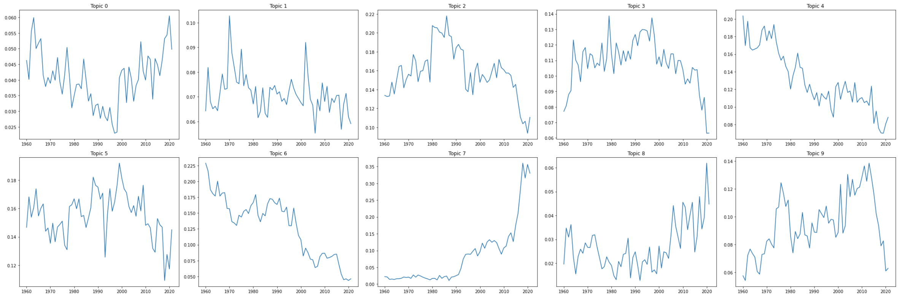

# Analyzing The Billboard Hot 100 Songs Over 1960-2021

Gaby Chu and Estelle Hooper authored this research report for final for INFO 3350: Text Mining for History and Literature in spring 2022. The prompt was open-ended: "Identify an interesting problem connected to the humanities or humanistic social sciences that's addressable with the help of computational methods, formulate a hypothesis about it, devise an experiment or experiments to test your hypothesis, present the results of your investigations, and discuss your findings."

# Table of Contents

- [Analyzing The Billboard Hot 100 Songs Over 1960-2021](#analyzing-the-billboard-hot-100-songs-over-1960-2021)
- [Table of Contents](#table-of-contents)
- [Overview](#overview)
    - [Techniques Implemented](#techniques-implemented)
    - [Motivation](#motivation)
    - [Research Question](#research-question)
    - [Project](#project)
- [Installation and Setup](#installation-and-setup)
    - [File Structure](#file-structure)
- [Data](#data)
- [Results](#results)
    - [Topic Visualizations](#topic-visualizations)
    - [Evaluation](#evaluation)
- [Future Work](#future-work)
- [Acknowledgements/References](#acknowledgementsreferences)
- [License](#license)

# Overview

### Techniques Implemented

 web-scraping, latent dirichlet allocation (LDA topic modeling), linear regression, logistic regression, cross-validation, word-embedding (spacy), GridSearch

### Motivation

The Billboard Hot 100 has ranked the most popular songs for a given week in the United States since 1958. While it's inevitable that the most popular genre/sound of music will evole over time, some musical themes, such as love, will persist. However, the lyrical content of these themes may fluctuate; for example, love songs in the past could have been more romantic but more sexual now.

### Research Question
>**What lyrical inspirations define the music industry every decade, and how has their treatment changed over time?**

By analyzing the most popular songs of 1960-2021 according to the Billboard Hot 100 charts and their lyrics, we hope to discover distinct topics in all these songs. We want to know the life cycle of these topics, such as if they endured across decades, fell or rose in popularity, or were only popular for a certain decade.

### Project

We will build our corpus by web-scraping the Billboard Hot 1000 charts from 1960-2021 to generate a list of the most popular songs, and subsequently web-scrape Genius.com to get each song's lyrics.

To answer our research question, we will use topic modeling on the most popular songs from 1960 to 2021 and visualize them using time-series plots and scatterplots. Then, we will verify these topics' distinctiveness to each decade or year in two avenues. First, we'll read samples of the songs assigned to these topics and their metadata (date on chart, weeks on chart, etc.). Second, we will predict year or decade using the matrix containing these topic-modeling distributions. We will compare those results with other representations of the lyric data, such as a standard bag-of-words matrix and a word-embedding matrix. We interpret the topic-modeling performance as a representation of decades could be represented well by lyric topics.

# Installation and Setup

This project was made with `python 3.9.12` with the following dependencies:
```
pandas
requests
bs4
matplotlib
numpy
os
re
seaborn
datetime
pyLDAvis
warnings
spacy
scikit-learn
```

`final-project-report.ipynb` contains the final, written report, including the main code used. his project was written entirely in Jupyter Lab. It is not recommended to rerun the cells in the notebook because the code outputs were copied and pasted from other notebooks, and the models can take hours to run. The rest of the jupyter notebook files contain exploratory data analysis, drafts, and extra code used.

### File Structure
[(Back to top)](#table-of-contents)

```
info3350-billboard-music
├── final-project-report.ipynb
├── songs.csv
├── working-files
│   ├── LDA.ipynb
│   ├── logistic-regression.ipynb
│   ├── predicting.ipynb
│   ├── webscraping_1976-1979.ipynb
|   └── webscraping.ipynb
├── LICENSE
└── README.md
```

# Data
[(Back to top)](#table-of-contents)

We curated the data used for this project `songs.csv` by web-scraping the [Billboard Hot 100](https://www.billboard.com/charts/hot-100/) to generate a list of the most popular songs, and [Genius](https://genius.com/) to obtain the songs lyrics. We restricted the corpus to 1960-2021 because of the availability of the data on Billboard.

Please note that the file is 459 MB and was uploaded to GitHub using GitHub Large File Storage.

The dataset from 1960-2021 contains 262,021 observations, but only 7.9% of those songs are unique. this makes sense because the Billboard Hot 100 charts captures minor flucuations in popularity. Therefore, 21,950 songs represent the most popular songs of the past 62 years, which is the number of observations in the .csv file.

Description of columns in the song dataset:
- `rank` rank of the song on the chart for that date
- `date` date of the week for the chart
- `title` title of the song
- `artist1` artist of the song
- `artist2` a list of of the rest of the featured/additional artists on the song
- `peak_pos` peak position of the chart (up until the observed date)
- `wks_chart` number of weeks the song has been on the chart (up until the observed date)
- `b_url` link to Billboard chart
- `lyrics` **lyrics of the song (a string), the text data we will be working with**
- `g_url` link to Genius lyrics website
- `year` the year of the chart
- `decade` the the 00s year of the chart

# Results

### Topic Visualizations
After running LDA on the corpus, here were the 10 topics we founds and the top 20 words for each:
Topic | Top 20 words in each topic
----- | ----
0 | she yeah her ooh girl that got me like said bad so my and know woman it was just woah
1 | my me be in on can da of life ll feel with and am by got all just you so
2 | we it and all ve be that is this of time for in can just never no ll been re
3 | you don do it me baby what wanna want know gonna can make say just be and got if give
4 | and of in he was is on they that for all man his little at out him with are from
5 | you me re that know can your so for never like just ve my when see what if it be
6 | love you your me ll and in be of will for my is need can with heart that let take
7 | that my in it on you like and up ain with me got they get for we no all don
8 | oh la na no hey ah me whoa ha uh de yeah hoo mi ooh yo ohoh ya woah baby
9 | it on get up and you your down like let go come that got back all can we in me

Document (Song) Counts per Topic (1960-2021)


- Many of the songs have a temporal trend. For example, the graph of the distribution of topics per year for topic 7 sees a sharp rise in the 1990s, with another, sharper rise in the mid 2010s. The topic, unlike the others, contains a mixture of swear words and slurs. According to [a study on the use of profanity on the American Billboard Charts](http://www.ijstr.org/final-print/feb2020/and-I-Swear-Profanity-In-Pop-Music-Lyrics-On-The-American-Billboard-Charts-2009-2018-And-The-Effect-On-Youtube-Popularity.pdfhttp://www.ijstr.org/final-print/feb2020/and-I-Swear-Profanity-In-Pop-Music-Lyrics-On-The-American-Billboard-Charts-2009-2018-And-The-Effect-On-Youtube-Popularity.pdf), the use of this profanity in songs is most widespread in the pop and rap/hip hop genre.

### Evaluation

Predicting the song's decade using different matrix representations, using logistic regression and cross-validation:
Song lyric matrix | Cross-validated R^2
--- | ---
Doc-topic | 0.287
Bag-of-words  | 0.323
Word-embedding | 0.355

To further test how distinguishable these topics are in accordance with the time period, we used the doc-topic matrix to cross validate and predict the decade of these songs. We conducted the same prediction task with a word-embedding matrix and a word counts (bag-of-words) matrix. If the doc-topic matrix performs better than the other two matrices, then we can conclude that topics are better predictors for years rather than the words themselves. Furthermore, we would be able to lean towards the conclusion that there are lyrical topics that define certain time periods.


From these results, we can see that word embedding had the best CV model score out of all the combinations of matrices and classifiers that we tried (additional ones detailed in the final report). This means that word embedding was the best way that we found to predict the decade that a song was charting on Billboard. We originally believed that the topic modeling would produce a better prediction of the years in which a song was charting. Because LDA produces a matrix that allows us to see the distribution of topics in each song, we thought this would produce a better prediction of song year, considering there seemed to be pretty strong temporal trends in mean topic based on previous visualizations. However, the doc-topic matrix performed the worst. We thought that this was interesting because a word embedding model represents the song in way that encodes the meaning of each lyrics so that the other lyrics that are closer to it in the vector space are expected to be similar in meaning, and a bag of words matrix strictly looks at word counts and distribution. Therefore, we hypothesized that both of these matrices would be better suited for producing outcomes such as song similarity, rather than time.
   
Our research question aimed to investigate what lyrical inspirations define each decade of the music industry, but seeing that our model based on topic modeling performed the worst, it suggests that the themes aren't a definitive feature of a decade in music. Perhaps, lyrical content could simply not be the best way to distinguish an era. There are many other features of songs, including tempo, rhythm, or genre. Another reason that song topics did not perform as well could be that the topics themselves were not as distinct as we originally thought that they would be. In trying to lower perplexity of the topic model, we increased the amount of topics, but that had trade-offs in distinguishability between the topics. In addition, with 10 topics, the matrix was much smaller (21950, 10) compared to the word embedding model which had 300 features (21950, 300), so there was less information that was being fed into the model. In conclusion, song topic was not a very good predictor of year or decade, meaning that lyrical content defined by topic is most likely not a definitive trait of the music of each decade.
  
# Future Work

[(Back to top)](#table-of-contents)

We believe that to further explore our question and build a more accurate classifier, it would be interesting to incorporate other metadata about these songs from the Spotify API, which records a song's genre and [other audio features](https://developer.spotify.com/documentation/web-api/reference/get-audio-features) like "loudness" and "instrumentalness." If a musical era is not defined by its lyrics, then what does?

# Acknowledgements/References
[(Back to top)](#table-of-contents)

Thank you to [Billboard](https://billboard.com) and [Genius](https://genius.com)!

Thank you to Professor Wilkens and the INFO 3350 staff in assisting us with the project. Code used from lectures is cited in the final research report.

# License
[(Back to top)](#table-of-contents)

[GNU General Public License](https://www.gnu.org/licenses/gpl-3.0.en.html)
